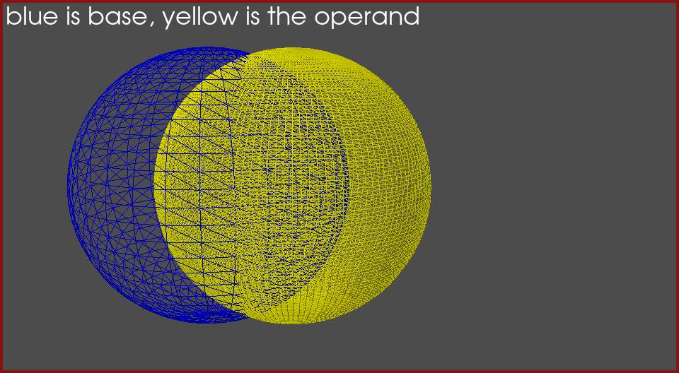

# rscad

Rusty Cad utils

## benchmark

boolean diff using on spheres using diffrent libraries


prepare benchmark
```
pip install pymadcad polydata
pip install pymadcad polydata
pip install . # or rscad
```

run benchmark
`python examples/sphers_bench`

out:
```
sphere1 has 1680 faceso
sphere2 has 26880 faces

rscad diff time: 0.188
n open edges: 0
is_manifold: True

poly diff time: 6.828
n open edges: 1132
is_manifold: False

mad diff time: 1.824
n open edges: 0
is_manifold: True
```
